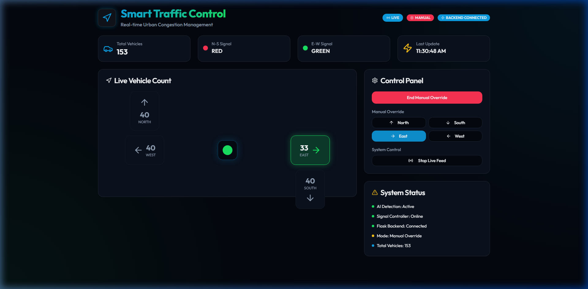
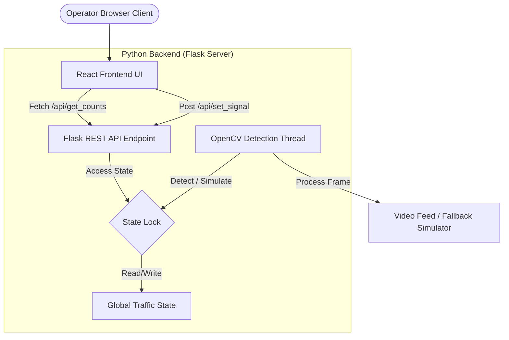

# 🚦 Smart Traffic Control Dashboard — Premium AI Management System

A real-time, AI-powered Smart Traffic Management System for urban congestion control. This project features a visually premium glassmorphic UI built with React, Vite, and Tailwind CSS, connected to a multi-threaded Python Flask backend. The backend manages automated AI signal optimization and executes a computer vision pipeline for vehicle detection.

---

## 📸 Screenshots

### Glassmorphic Control Console


---

## ✨ Features

### Operator Dashboard (Frontend)
* **Real-Time Visualization Grid**: Displays dynamic vehicle queues and lane occupancy at a four-way intersection (North, South, East, West).
* **Interactive Control Panel**: Switch between automated AI scheduling and manual operator override with single-click signal locks.
* **Blinking Status Indicators**: Real-time traffic light simulators displaying green and red indicators synchronized with the server's state.
* **Glassmorphic Cyber-Dark UI**: Premium aesthetics using backdrop blur, neon glowing borders, custom grids, and radial gradients.

### AI Engine & Computer Vision (Backend)
* **Computer Vision Pipeline**: Integrates OpenCV with a background subtractor (MOG2) and morphological filters to count moving vehicles in a video feed.
* **AI Signal Controller**: Analyzes congestion ratios and dynamically scales green light intervals (between 8s and 30s) to clear high-density lanes first.
* **Multi-Threaded Server Design**: Separates the OpenCV detection loops/simulators from the Flask API routes using background daemon threads and state-locking mechanisms (`threading.Lock`).
* **Robust Fallback Mode**: Gracefully degrades to a high-fidelity stochastic traffic simulation if OpenCV or a video file is missing.

---

## 🧰 Tech Stack

| Category | Technology | Description |
| :--- | :--- | :--- |
| **Frontend Framework** | React 18 + Vite | Component architecture & high-performance build tool |
| **Styling & Theme** | Tailwind CSS + shadcn/ui | Backdrop-blur panels and responsive layouts |
| **Icons** | Lucide React | Clean, scalable vector indicators |
| **Backend Framework**| Flask (Python 3.x) | REST API endpoints & static assets server |
| **Computer Vision** | OpenCV (cv2) | Background subtraction & object contour counting |
| **State Synchronization** | Flask-CORS | Enables secure cross-origin resource requests |

---

## 🏗️ System Architecture

The dashboard uses a decoupled frontend-backend client-server architecture with state locking to prevent data race conditions:



### Architectural Breakdown
* **Vite Static Asset Delivery**: The frontend React app is built into the backend's static directory (`dist/`) enabling a single process deploy.
* **Thread-Safe State Access**: The background vehicle detector and the API server access the global traffic metrics within a mutual exclusion lock (`Lock`) to guarantee consistency.
* **Event-Driven Override**: Triggering a manual override temporarily suspends the AI signal timing loop until the operator releases control back to "Auto" mode.

---

## 📦 How to Run

### Prerequisites
* **Node.js** v20 or newer
* **Python** 3.10 or newer

### 1. Project Setup
Clone the repository:
```bash
git clone https://github.com/vijaybarhate/Smart-Traffic-Control-Dashboard.git
cd Smart-Traffic-Control-Dashboard
```

### 2. Frontend Installation & Build
Install node modules and compile the React application:
```bash
npm install
npm run build
```
The compiled files are generated in the `dist` folder.

### 3. Backend Setup & Run
Install Python dependencies:
```bash
pip install -r requirements.txt
```

Run the server:
```bash
python app.py
```

Open your browser and navigate to: **`http://localhost:5000`**

*Note: The server will automatically detect the compiled React folder and serve the dashboard directly. If a camera or video file is not available, the server will log a fallback notice and start a stochastic queue simulator, allowing full UI exploration.*

---

## 🧠 Challenges Faced

- **Thread Congestion & State Race Conditions**: The OpenCV detection thread runs in a continuous loop, while Flask spawns individual request handlers. Reading and writing the traffic totals simultaneously caused occasional state desyncs. We resolved this by wrapping access in a Python `threading.Lock()`, securing data integrity without affecting throughput.
- **Dependency Versioning**: Interfacing OpenCV with standard packages occasionally created compiler conflicts with standard libraries. Setting up `opencv-python-headless` resolved server deployment requirements without pulling in heavy GUI dependencies.
- **Fallback Reliability**: To ensure recruiters can run the project out-of-the-box without needing specific cameras or hardware, we built a fallback algorithm. If `cv2` fails to import or the video file is missing, the backend seamlessly launches a simulated queues engine using random variables, maintaining a fully responsive frontend experience.

---

## 🔮 Future Improvements

- [ ] **Multi-Intersection Network**: Coordinate signals across multiple adjacent intersections (green wave coordination).
- [ ] **YOLO Model Integration**: Replace simple contour tracking with a deep learning model (e.g., YOLOv8) for precise vehicle classification (buses, trucks, emergency vehicles).
- [ ] **RTSP Live Stream Integration**: Connect direct network camera feeds for deployment in real urban zones.
- [ ] **Time-Series Analytics**: Add chart grids displaying average congestion graphs over time.

---

Built with 🖤 by [Vijay Barhate](https://github.com/vijaybarhate)
